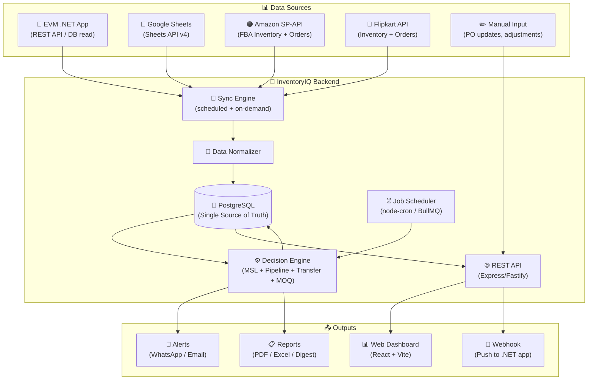
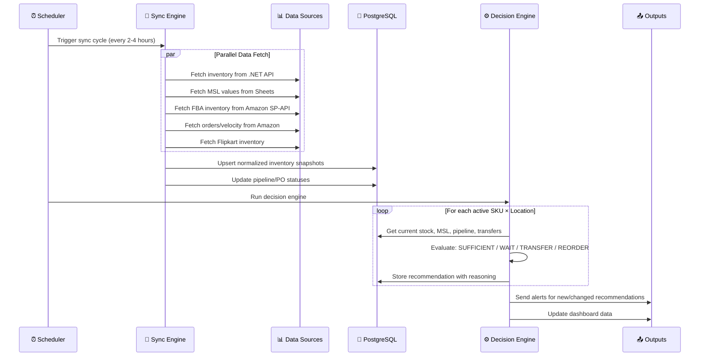
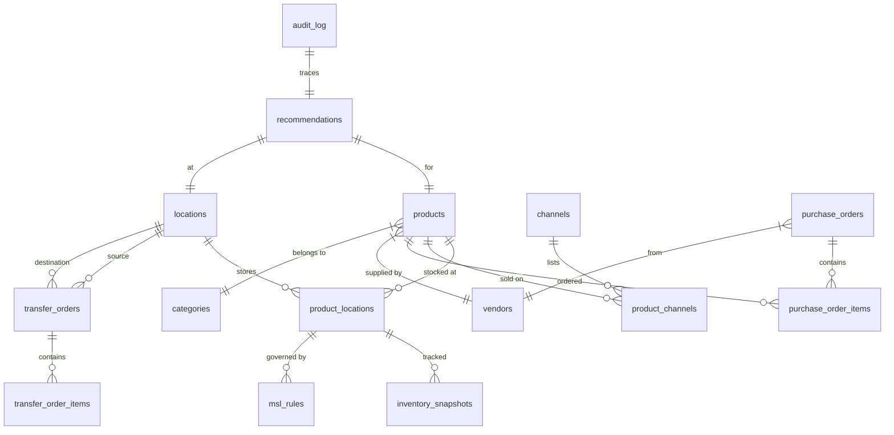
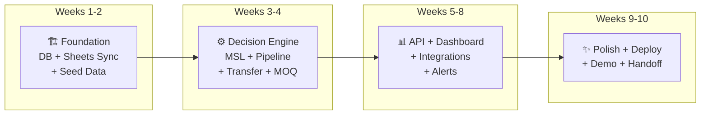
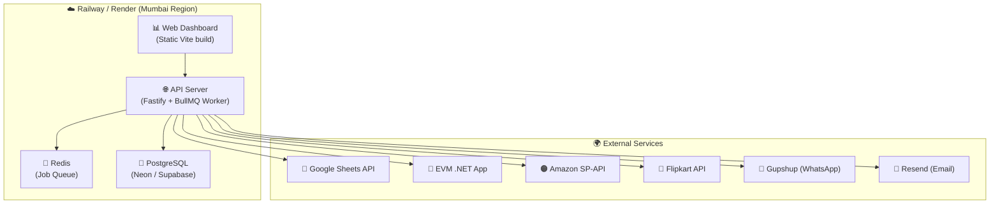

# InventoryIQ — Production-Grade Implementation Plan
## MSL & Inventory Automation System for EVM Zone

---

## 1. Goal

Build a production-grade **Inventory Intelligence System** that automates EVM's manual inventory replenishment decision-making process. The system will continuously evaluate stock positions across all warehouses and sales channels, account for pipeline/in-transit inventory, and generate actionable recommendations: **wait, transfer, or reorder** — with full audit trail and reasoning.

### What Success Looks Like

| Metric | Before (Manual) | After (InventoryIQ) |
|---|---|---|
| **Time to evaluate inventory** | Hours/day (2 people) | Real-time, automated |
| **Decision accuracy** | Dependent on individual judgment | Consistent rules engine |
| **Visibility** | Scattered across Sheets + .NET app | Single unified dashboard |
| **Response time to stockout risk** | Hours to days (manual review cycle) | Minutes (automated alerts) |
| **Pipeline inventory visibility** | Manual PO tracking | Live pipeline view per SKU |
| **Audit trail** | None / informal | Full decision logs with reasoning |

---

## 2. User Review Required

> [!IMPORTANT]
> **Integration Strategy**: This plan assumes we build InventoryIQ as a **standalone system that integrates with EVM's existing tools** (ReactJS/.NET app, Google Sheets) rather than replacing them. This is the lowest-risk approach for a first iteration. We read data from their systems and push recommendations back.

> [!WARNING]
> **Data Dependency**: The quality of recommendations is only as good as the data. If PO data, MSL values, or inventory counts are stale or incomplete in EVM's systems, InventoryIQ's recommendations will be unreliable. We need to establish data freshness SLAs with EVM.

> [!IMPORTANT]
> **Scope of V1**: This plan covers a **V1 that focuses on the decision engine + dashboard + alerts**. It does NOT auto-execute POs or transfers — it recommends and waits for human approval. Auto-execution is a V2 feature after trust is established.

---

## 3. Open Questions

> [!IMPORTANT]
> These questions must be answered (via the questionnaire shared with Prashant) before development begins. The plan includes reasonable assumptions where needed, but these will be validated.

1. **How many warehouses/locations?** — Plan assumes 1 primary (Vasai East) + FBA locations + Flipkart locations. Need confirmation.
2. **E-commerce MSL granularity** — Is it per-channel (Amazon MSL, Flipkart MSL) or pooled "e-commerce MSL"?
3. **Access to .NET app API** — Can we get read API access, or do we need to scrape/export?
4. **Google Sheets structure** — Which sheets contain what data? Can we get Sheets API access?
5. **Amazon SP-API access** — Does EVM have developer API credentials for their seller account?
6. **Who approves recommendations?** — Is there an approval chain, or can the ops team act directly?

---

## 4. System Architecture

### 4.1 High-Level Architecture



### 4.2 Data Flow — Sync Cycle



---

## 5. Tech Stack

| Layer | Technology | Rationale |
|---|---|---|
| **Language** | TypeScript (Node.js ≥ 20) | Consistent with PriceWatch; full-stack capability; strong typing for business logic |
| **Backend Framework** | Fastify | Faster than Express; schema validation built-in; better for production |
| **Database** | PostgreSQL 16 (via Neon / Supabase / self-hosted) | Production-grade; supports JSONB for flexible data; excellent for time-series queries; row-level security |
| **ORM / Query** | Drizzle ORM | Type-safe SQL; lightweight; good migration story; no magic |
| **Job Queue** | BullMQ (Redis-backed) | Reliable job scheduling; retries; concurrency control; dashboard (Bull Board) |
| **Frontend** | React 18 + Vite + Tailwind CSS + shadcn/ui | Modern, fast; consistent with PriceWatch web; excellent component library |
| **Charts** | Recharts + Tremor | Dashboarding components purpose-built for data-heavy UIs |
| **Auth** | Simple JWT (V1) → Clerk/Auth.js (V2) | Start simple, add SSO/RBAC later |
| **Google Sheets** | `googleapis` npm (Sheets API v4) | Official SDK; read/write; real-time sync |
| **Amazon** | `@sp-api-sdk/*` | Community SDK for SP-API; typed endpoints |
| **WhatsApp** | Gupshup / WhatsApp Cloud API | Indian BSP; cost-effective for transactional messages |
| **Email** | Resend / AWS SES | Transactional email; templated alerts |
| **Deployment** | Railway / Render / AWS (ECS) | Managed; auto-deploy from Git; Mumbai region |
| **Monorepo** | npm workspaces (existing pattern) | Consistent with PriceWatch monorepo |

---

## 6. Monorepo Structure

```
InventoryIQ/                          # New top-level directory
├── package.json                      # Workspace root
├── tsconfig.base.json
├── .env.example
│
├── packages/
│   ├── core/                         # Domain types, DB schema, decision engine
│   │   ├── src/
│   │   │   ├── types.ts              # All domain interfaces
│   │   │   ├── schema.ts             # Drizzle schema definitions
│   │   │   ├── db.ts                 # Database connection manager
│   │   │   ├── migrate.ts            # Migration runner
│   │   │   ├── repo.ts               # Data access layer (repository pattern)
│   │   │   ├── engine/
│   │   │   │   ├── index.ts          # Decision engine orchestrator
│   │   │   │   ├── msl-evaluator.ts  # MSL check logic
│   │   │   │   ├── pipeline-checker.ts # Pipeline/in-transit evaluator
│   │   │   │   ├── transfer-advisor.ts # Inter-warehouse transfer logic
│   │   │   │   ├── moq-adjuster.ts   # MOQ calculation
│   │   │   │   └── engine.test.ts    # Unit tests
│   │   │   ├── seed.ts               # Demo/initial data seeder
│   │   │   └── index.ts
│   │   └── package.json
│   │
│   └── integrations/                 # Data source connectors
│       ├── src/
│       │   ├── types.ts              # Connector interfaces
│       │   ├── google-sheets/
│       │   │   ├── client.ts         # Sheets API client
│       │   │   ├── inventory-sync.ts # Map Sheets → normalized inventory
│       │   │   ├── msl-sync.ts       # Map Sheets → MSL values
│       │   │   └── sheets.test.ts
│       │   ├── dotnet-api/
│       │   │   ├── client.ts         # HTTP client for .NET app
│       │   │   ├── inventory-sync.ts
│       │   │   └── po-sync.ts        # Purchase order sync
│       │   ├── amazon/
│       │   │   ├── sp-api-client.ts  # Amazon SP-API wrapper
│       │   │   ├── fba-inventory.ts  # FBA stock levels
│       │   │   ├── orders.ts         # Sales velocity data
│       │   │   └── amazon.test.ts
│       │   ├── flipkart/
│       │   │   ├── client.ts
│       │   │   ├── inventory-sync.ts
│       │   │   └── flipkart.test.ts
│       │   ├── notifications/
│       │   │   ├── whatsapp.ts       # Gupshup/WA Cloud API
│       │   │   ├── email.ts          # Resend/SES
│       │   │   └── templates/        # Message templates
│       │   └── index.ts
│       └── package.json
│
├── apps/
│   ├── api/                          # Backend API server
│   │   ├── src/
│   │   │   ├── index.ts              # Server entry
│   │   │   ├── server.ts             # Fastify setup
│   │   │   ├── routes/
│   │   │   │   ├── inventory.ts      # /api/inventory/*
│   │   │   │   ├── recommendations.ts # /api/recommendations/*
│   │   │   │   ├── purchase-orders.ts # /api/pos/*
│   │   │   │   ├── transfers.ts      # /api/transfers/*
│   │   │   │   ├── alerts.ts         # /api/alerts/*
│   │   │   │   ├── sync.ts           # /api/sync/*
│   │   │   │   ├── reports.ts        # /api/reports/*
│   │   │   │   └── dashboard.ts      # /api/dashboard/*
│   │   │   ├── jobs/
│   │   │   │   ├── sync-job.ts       # Scheduled data sync
│   │   │   │   ├── engine-job.ts     # Scheduled engine run
│   │   │   │   └── alert-job.ts      # Notification dispatch
│   │   │   └── middleware/
│   │   │       ├── auth.ts
│   │   │       └── error-handler.ts
│   │   └── package.json
│   │
│   └── web/                          # Dashboard frontend
│       ├── src/
│       │   ├── main.tsx
│       │   ├── api.ts                # API client
│       │   ├── components/
│       │   │   ├── Layout.tsx
│       │   │   ├── SkuCard.tsx
│       │   │   ├── RecommendationBadge.tsx
│       │   │   ├── StockGauge.tsx
│       │   │   ├── PipelineTimeline.tsx
│       │   │   └── ...
│       │   ├── views/
│       │   │   ├── Dashboard.tsx      # Overview KPIs
│       │   │   ├── Inventory.tsx      # SKU × Location matrix
│       │   │   ├── Recommendations.tsx # Action items
│       │   │   ├── PurchaseOrders.tsx  # PO tracking
│       │   │   ├── Transfers.tsx      # Transfer tracking
│       │   │   ├── SkuDetail.tsx      # Deep dive per SKU
│       │   │   ├── Settings.tsx       # MSL rules, thresholds
│       │   │   └── Reports.tsx        # Generate/download
│       │   └── styles.css
│       └── package.json
│
└── drizzle/                          # Migration files
    └── migrations/
```

---

## 7. Database Schema

### 7.1 Entity Relationship Diagram



### 7.2 Core Tables

```sql
-- ============================================
-- MASTER DATA
-- ============================================

CREATE TABLE categories (
    id              SERIAL PRIMARY KEY,
    name            TEXT NOT NULL UNIQUE,        -- 'chargers', 'power_banks', 'cables', etc.
    description     TEXT,
    created_at      TIMESTAMPTZ NOT NULL DEFAULT NOW()
);

CREATE TABLE vendors (
    id              SERIAL PRIMARY KEY,
    name            TEXT NOT NULL,
    code            TEXT UNIQUE,                 -- short code like 'VND-SZ-01'
    country         TEXT NOT NULL DEFAULT 'CN',  -- CN, TW, HK
    contact_name    TEXT,
    contact_email   TEXT,
    default_lead_time_days INTEGER NOT NULL DEFAULT 45,
    default_moq     INTEGER NOT NULL DEFAULT 100,
    payment_terms   TEXT,                        -- 'LC', 'TT 30 days', etc.
    is_active       BOOLEAN NOT NULL DEFAULT TRUE,
    created_at      TIMESTAMPTZ NOT NULL DEFAULT NOW(),
    updated_at      TIMESTAMPTZ NOT NULL DEFAULT NOW()
);

CREATE TABLE products (
    id              SERIAL PRIMARY KEY,
    sku             TEXT NOT NULL UNIQUE,         -- 'EVM-CH-023'
    name            TEXT NOT NULL,
    category_id     INTEGER REFERENCES categories(id),
    vendor_id       INTEGER REFERENCES vendors(id),
    mrp             NUMERIC(10,2),               -- Maximum Retail Price
    unit_cost       NUMERIC(10,2),               -- Landing cost per unit
    weight_grams    INTEGER,
    image_url       TEXT,
    vendor_moq      INTEGER,                     -- Override vendor default MOQ for this SKU
    vendor_lead_time_days INTEGER,               -- Override vendor default lead time
    is_active       BOOLEAN NOT NULL DEFAULT TRUE,
    metadata        JSONB DEFAULT '{}',          -- flexible extension
    created_at      TIMESTAMPTZ NOT NULL DEFAULT NOW(),
    updated_at      TIMESTAMPTZ NOT NULL DEFAULT NOW()
);

CREATE TABLE locations (
    id              SERIAL PRIMARY KEY,
    name            TEXT NOT NULL,                -- 'Vasai East Central', 'Amazon FC Mumbai', etc.
    code            TEXT NOT NULL UNIQUE,         -- 'VASAI', 'AMZ-BOM', 'FK-BLR'
    type            TEXT NOT NULL,                -- 'own_warehouse', 'fba', 'flipkart_assured', 'distributor'
    city            TEXT,
    state           TEXT,
    is_ecommerce    BOOLEAN NOT NULL DEFAULT FALSE,
    is_active       BOOLEAN NOT NULL DEFAULT TRUE,
    metadata        JSONB DEFAULT '{}',
    created_at      TIMESTAMPTZ NOT NULL DEFAULT NOW()
);

CREATE TABLE channels (
    id              SERIAL PRIMARY KEY,
    name            TEXT NOT NULL UNIQUE,         -- 'evmzone', 'amazon', 'flipkart', 'wholesale'
    label           TEXT NOT NULL,                -- 'EVM Zone (Own Site)'
    type            TEXT NOT NULL,                -- 'marketplace', 'own_store', 'retail', 'wholesale'
    api_enabled     BOOLEAN NOT NULL DEFAULT FALSE,
    is_active       BOOLEAN NOT NULL DEFAULT TRUE,
    created_at      TIMESTAMPTZ NOT NULL DEFAULT NOW()
);

-- ============================================
-- INVENTORY & MSL
-- ============================================

-- Current inventory position per SKU per location
CREATE TABLE product_locations (
    id              SERIAL PRIMARY KEY,
    product_id      INTEGER NOT NULL REFERENCES products(id),
    location_id     INTEGER NOT NULL REFERENCES locations(id),
    current_stock   INTEGER NOT NULL DEFAULT 0,
    reserved_stock  INTEGER NOT NULL DEFAULT 0,  -- committed to orders, not yet shipped
    damaged_stock   INTEGER NOT NULL DEFAULT 0,
    last_counted_at TIMESTAMPTZ,
    last_synced_at  TIMESTAMPTZ NOT NULL DEFAULT NOW(),
    sync_source     TEXT,                        -- 'sheets', 'dotnet_api', 'amazon_sp_api', 'manual'
    UNIQUE (product_id, location_id)
);

-- Channel-specific product listing (links product to sales channel)
CREATE TABLE product_channels (
    id              SERIAL PRIMARY KEY,
    product_id      INTEGER NOT NULL REFERENCES products(id),
    channel_id      INTEGER NOT NULL REFERENCES channels(id),
    location_id     INTEGER REFERENCES locations(id), -- which location fulfills this channel
    remote_id       TEXT,                        -- ASIN, Flipkart FSN, etc.
    listing_url     TEXT,
    is_active       BOOLEAN NOT NULL DEFAULT TRUE,
    UNIQUE (product_id, channel_id)
);

-- MSL rules — the core business rules
CREATE TABLE msl_rules (
    id              SERIAL PRIMARY KEY,
    product_id      INTEGER NOT NULL REFERENCES products(id),
    location_id     INTEGER REFERENCES locations(id),    -- NULL = global default
    channel_id      INTEGER REFERENCES channels(id),     -- NULL = all channels at location
    min_stock_level INTEGER NOT NULL,                    -- the MSL value
    warning_level   INTEGER,                             -- optional: warn before MSL breach
    critical_level  INTEGER,                             -- optional: critical threshold
    is_dynamic      BOOLEAN NOT NULL DEFAULT FALSE,      -- future: auto-calculate based on velocity
    effective_from  DATE NOT NULL DEFAULT CURRENT_DATE,
    effective_until DATE,                                -- NULL = no expiry
    notes           TEXT,
    created_at      TIMESTAMPTZ NOT NULL DEFAULT NOW(),
    updated_at      TIMESTAMPTZ NOT NULL DEFAULT NOW(),
    UNIQUE (product_id, location_id, channel_id)
);

-- Time-series: inventory level history (append-only)
CREATE TABLE inventory_snapshots (
    id              SERIAL PRIMARY KEY,
    product_location_id INTEGER NOT NULL REFERENCES product_locations(id),
    stock_level     INTEGER NOT NULL,
    reserved        INTEGER NOT NULL DEFAULT 0,
    available       INTEGER NOT NULL,            -- stock_level - reserved
    snapshot_at     TIMESTAMPTZ NOT NULL DEFAULT NOW(),
    sync_batch_id   INTEGER
);

CREATE INDEX idx_inv_snapshots_pl_time
    ON inventory_snapshots(product_location_id, snapshot_at DESC);

-- ============================================
-- PURCHASE ORDERS & PIPELINE
-- ============================================

CREATE TABLE purchase_orders (
    id              SERIAL PRIMARY KEY,
    po_number       TEXT NOT NULL UNIQUE,         -- 'PO-2026-0042'
    vendor_id       INTEGER NOT NULL REFERENCES vendors(id),
    status          TEXT NOT NULL DEFAULT 'draft',
    -- Status lifecycle: draft → confirmed → shipped → in_transit → customs → received → closed
    order_date      DATE,
    expected_ship_date DATE,
    expected_arrival_date DATE,
    actual_ship_date DATE,
    actual_arrival_date DATE,
    shipping_method TEXT,                         -- 'sea_fcl', 'sea_lcl', 'air'
    tracking_number TEXT,
    customs_status  TEXT,                         -- 'pending', 'cleared', 'held'
    destination_location_id INTEGER REFERENCES locations(id),
    total_value     NUMERIC(12,2),
    currency        TEXT NOT NULL DEFAULT 'INR',
    notes           TEXT,
    source          TEXT DEFAULT 'manual',        -- 'manual', 'inventoryiq_recommended', 'dotnet_sync'
    created_by      TEXT,
    metadata        JSONB DEFAULT '{}',
    created_at      TIMESTAMPTZ NOT NULL DEFAULT NOW(),
    updated_at      TIMESTAMPTZ NOT NULL DEFAULT NOW()
);

CREATE TABLE purchase_order_items (
    id              SERIAL PRIMARY KEY,
    po_id           INTEGER NOT NULL REFERENCES purchase_orders(id) ON DELETE CASCADE,
    product_id      INTEGER NOT NULL REFERENCES products(id),
    ordered_qty     INTEGER NOT NULL,
    received_qty    INTEGER NOT NULL DEFAULT 0,   -- supports partial fulfillment
    unit_cost       NUMERIC(10,2),
    UNIQUE (po_id, product_id)
);

-- ============================================
-- INTERNAL TRANSFERS
-- ============================================

CREATE TABLE transfer_orders (
    id              SERIAL PRIMARY KEY,
    transfer_number TEXT NOT NULL UNIQUE,         -- 'TRF-2026-0015'
    source_location_id INTEGER NOT NULL REFERENCES locations(id),
    dest_location_id   INTEGER NOT NULL REFERENCES locations(id),
    status          TEXT NOT NULL DEFAULT 'draft',
    -- Status: draft → approved → in_transit → received → closed
    requested_date  DATE NOT NULL DEFAULT CURRENT_DATE,
    expected_arrival_date DATE,
    actual_arrival_date DATE,
    source          TEXT DEFAULT 'manual',        -- 'manual', 'inventoryiq_recommended'
    reason          TEXT,                         -- engine-generated explanation
    created_by      TEXT,
    created_at      TIMESTAMPTZ NOT NULL DEFAULT NOW(),
    updated_at      TIMESTAMPTZ NOT NULL DEFAULT NOW()
);

CREATE TABLE transfer_order_items (
    id              SERIAL PRIMARY KEY,
    transfer_id     INTEGER NOT NULL REFERENCES transfer_orders(id) ON DELETE CASCADE,
    product_id      INTEGER NOT NULL REFERENCES products(id),
    requested_qty   INTEGER NOT NULL,
    shipped_qty     INTEGER NOT NULL DEFAULT 0,
    received_qty    INTEGER NOT NULL DEFAULT 0,
    UNIQUE (transfer_id, product_id)
);

-- ============================================
-- DECISION ENGINE OUTPUT
-- ============================================

CREATE TABLE recommendations (
    id              SERIAL PRIMARY KEY,
    product_id      INTEGER NOT NULL REFERENCES products(id),
    location_id     INTEGER NOT NULL REFERENCES locations(id),
    channel_id      INTEGER REFERENCES channels(id),
    
    -- The decision
    action          TEXT NOT NULL,               -- 'no_action', 'wait', 'transfer', 'reorder'
    urgency         TEXT NOT NULL DEFAULT 'normal', -- 'low', 'normal', 'high', 'critical'
    
    -- Context at time of decision
    current_stock   INTEGER NOT NULL,
    applicable_msl  INTEGER NOT NULL,
    deficit         INTEGER,                     -- MSL - current_stock (NULL if no deficit)
    pipeline_qty    INTEGER NOT NULL DEFAULT 0,  -- incoming from POs
    pipeline_eta    DATE,                        -- earliest expected arrival
    transferable_qty INTEGER NOT NULL DEFAULT 0, -- available from other locations
    
    -- If action = 'reorder'
    recommended_order_qty INTEGER,
    vendor_moq      INTEGER,
    raw_deficit     INTEGER,                     -- before MOQ adjustment
    vendor_id       INTEGER REFERENCES vendors(id),
    estimated_lead_time_days INTEGER,
    
    -- If action = 'transfer'
    source_location_id INTEGER REFERENCES locations(id),
    recommended_transfer_qty INTEGER,
    
    -- Explanation
    reasoning       TEXT NOT NULL,               -- Human-readable explanation
    reasoning_detail JSONB,                      -- Structured reasoning for UI display
    
    -- Lifecycle
    status          TEXT NOT NULL DEFAULT 'pending',
    -- Status: pending → acknowledged → acted_upon → dismissed → superseded
    acted_by        TEXT,
    acted_at        TIMESTAMPTZ,
    
    -- Audit
    engine_run_id   INTEGER,
    created_at      TIMESTAMPTZ NOT NULL DEFAULT NOW(),
    superseded_at   TIMESTAMPTZ                  -- when a new recommendation replaces this one
);

CREATE INDEX idx_reco_status ON recommendations(status) WHERE status = 'pending';
CREATE INDEX idx_reco_product ON recommendations(product_id, created_at DESC);

-- Engine run log — one row per engine execution
CREATE TABLE engine_runs (
    id              SERIAL PRIMARY KEY,
    started_at      TIMESTAMPTZ NOT NULL DEFAULT NOW(),
    completed_at    TIMESTAMPTZ,
    status          TEXT NOT NULL DEFAULT 'running', -- 'running', 'completed', 'failed'
    skus_evaluated  INTEGER NOT NULL DEFAULT 0,
    recommendations_created INTEGER NOT NULL DEFAULT 0,
    recommendations_unchanged INTEGER NOT NULL DEFAULT 0,
    alerts_sent     INTEGER NOT NULL DEFAULT 0,
    triggered_by    TEXT NOT NULL DEFAULT 'scheduler', -- 'scheduler', 'manual', 'api'
    error_message   TEXT,
    summary         JSONB
);

-- ============================================
-- ALERTS & NOTIFICATIONS
-- ============================================

CREATE TABLE alerts (
    id              SERIAL PRIMARY KEY,
    recommendation_id INTEGER REFERENCES recommendations(id),
    product_id      INTEGER NOT NULL REFERENCES products(id),
    type            TEXT NOT NULL,               -- 'below_msl', 'critical_stock', 'po_delayed',
                                                 -- 'transfer_needed', 'reorder_needed', 'stockout_risk'
    severity        TEXT NOT NULL,               -- 'info', 'warning', 'critical'
    title           TEXT NOT NULL,
    message         TEXT NOT NULL,
    status          TEXT NOT NULL DEFAULT 'active', -- 'active', 'acknowledged', 'resolved', 'snoozed'
    acknowledged_by TEXT,
    acknowledged_at TIMESTAMPTZ,
    resolved_at     TIMESTAMPTZ,
    snoozed_until   TIMESTAMPTZ,
    created_at      TIMESTAMPTZ NOT NULL DEFAULT NOW()
);

CREATE TABLE notification_log (
    id              SERIAL PRIMARY KEY,
    alert_id        INTEGER REFERENCES alerts(id),
    channel         TEXT NOT NULL,               -- 'whatsapp', 'email', 'dashboard', 'webhook'
    recipient       TEXT NOT NULL,
    status          TEXT NOT NULL,               -- 'sent', 'delivered', 'failed', 'pending'
    sent_at         TIMESTAMPTZ,
    error_message   TEXT,
    metadata        JSONB DEFAULT '{}'
);

-- ============================================
-- SYNC & AUDIT
-- ============================================

CREATE TABLE sync_batches (
    id              SERIAL PRIMARY KEY,
    source          TEXT NOT NULL,               -- 'google_sheets', 'dotnet_api', 'amazon_sp_api', 'flipkart_api'
    started_at      TIMESTAMPTZ NOT NULL DEFAULT NOW(),
    completed_at    TIMESTAMPTZ,
    status          TEXT NOT NULL DEFAULT 'running',
    records_fetched INTEGER NOT NULL DEFAULT 0,
    records_updated INTEGER NOT NULL DEFAULT 0,
    records_failed  INTEGER NOT NULL DEFAULT 0,
    error_message   TEXT
);

CREATE TABLE audit_log (
    id              SERIAL PRIMARY KEY,
    entity_type     TEXT NOT NULL,               -- 'product', 'inventory', 'msl_rule', 'po', 'transfer', 'recommendation'
    entity_id       INTEGER NOT NULL,
    action          TEXT NOT NULL,               -- 'created', 'updated', 'deleted', 'status_changed'
    old_value       JSONB,
    new_value       JSONB,
    changed_by      TEXT NOT NULL DEFAULT 'system',
    changed_at      TIMESTAMPTZ NOT NULL DEFAULT NOW()
);

CREATE INDEX idx_audit_entity ON audit_log(entity_type, entity_id, changed_at DESC);

-- ============================================
-- SALES VELOCITY (for future dynamic MSL)
-- ============================================

CREATE TABLE sales_velocity (
    id              SERIAL PRIMARY KEY,
    product_id      INTEGER NOT NULL REFERENCES products(id),
    channel_id      INTEGER REFERENCES channels(id),
    period_start    DATE NOT NULL,
    period_end      DATE NOT NULL,
    units_sold      INTEGER NOT NULL,
    avg_daily_units NUMERIC(8,2),
    data_source     TEXT,                        -- 'amazon_sp_api', 'flipkart_api', 'manual'
    synced_at       TIMESTAMPTZ NOT NULL DEFAULT NOW(),
    UNIQUE (product_id, channel_id, period_start)
);
```

---

## 8. Decision Engine — Core Algorithm

This is the heart of InventoryIQ. The engine runs periodically (configurable: every 2-4 hours) and evaluates every active SKU at every active location.

### 8.1 Engine Pseudocode

```typescript
interface EngineInput {
  product: Product;
  location: Location;
  currentStock: number;
  reservedStock: number;
  applicableMSL: number;       // resolved from msl_rules
  ecommerceMSL?: number;       // separate e-commerce MSL if applicable
  pipelineItems: PipelineItem[]; // in-transit + open POs for this SKU/location
  otherLocations: LocationStock[]; // stock at other warehouses
  vendorMOQ: number;
  vendorLeadTimeDays: number;
  salesVelocity?: number;      // avg daily units (optional, for V2 dynamic MSL)
}

interface Recommendation {
  action: 'no_action' | 'wait' | 'transfer' | 'reorder';
  urgency: 'low' | 'normal' | 'high' | 'critical';
  reasoning: string;
  details: RecommendationDetails;
}

function evaluate(input: EngineInput): Recommendation {
  const availableStock = input.currentStock - input.reservedStock;
  const deficit = input.applicableMSL - availableStock;
  
  // ─── STEP 1: Is stock sufficient? ───
  if (deficit <= 0) {
    return {
      action: 'no_action',
      urgency: 'low',
      reasoning: `Stock (${availableStock}) is above MSL (${input.applicableMSL}). No action needed.`,
      details: { surplus: Math.abs(deficit) }
    };
  }
  
  // ─── STEP 2: Check pipeline inventory ───
  const totalPipeline = sumPipelineQty(input.pipelineItems);
  const effectiveSupply = availableStock + totalPipeline;
  
  if (effectiveSupply >= input.applicableMSL) {
    const earliestArrival = getEarliestArrival(input.pipelineItems);
    return {
      action: 'wait',
      urgency: daysUntilCritical(availableStock, input.applicableMSL, input.salesVelocity) < 7
        ? 'normal' : 'low',
      reasoning: `Stock (${availableStock}) is below MSL (${input.applicableMSL}), `
        + `but ${totalPipeline} units are in pipeline. `
        + `Expected arrival: ${earliestArrival}. No new order needed.`,
      details: { pipelineQty: totalPipeline, pipelineEta: earliestArrival }
    };
  }
  
  // ─── STEP 3: Check internal transfer possibility ───
  const remainingDeficit = input.applicableMSL - effectiveSupply;
  const transferOptions = findTransferableSources(
    input.product.id,
    input.location.id,
    input.otherLocations,
    remainingDeficit
  );
  
  if (transferOptions.totalTransferable >= remainingDeficit) {
    return {
      action: 'transfer',
      urgency: 'normal',
      reasoning: `Stock (${availableStock}) + Pipeline (${totalPipeline}) = ${effectiveSupply} `
        + `< MSL (${input.applicableMSL}). `
        + `${remainingDeficit} units can be transferred from ${transferOptions.sources.map(s => s.locationName).join(', ')} `
        + `without violating their MSL.`,
      details: {
        transferSources: transferOptions.sources,
        totalTransferQty: remainingDeficit
      }
    };
  }
  
  // ─── STEP 4: Vendor reorder required ───
  const partialTransfer = transferOptions.totalTransferable;
  const orderDeficit = remainingDeficit - partialTransfer;
  const moqAdjustedQty = applyMOQ(orderDeficit, input.vendorMOQ);
  
  return {
    action: 'reorder',
    urgency: availableStock <= 0 ? 'critical'
      : availableStock < input.applicableMSL * 0.25 ? 'high'
      : 'normal',
    reasoning: `Stock (${availableStock}) + Pipeline (${totalPipeline}) + Transferable (${partialTransfer}) `
      + `= ${effectiveSupply + partialTransfer} < MSL (${input.applicableMSL}). `
      + `Vendor reorder required. Raw deficit: ${orderDeficit}, `
      + `MOQ-adjusted order: ${moqAdjustedQty} units. `
      + `Estimated delivery: ${input.vendorLeadTimeDays} days.`,
    details: {
      rawDeficit: orderDeficit,
      moqAdjustedQty,
      vendorMOQ: input.vendorMOQ,
      estimatedLeadTime: input.vendorLeadTimeDays,
      partialTransfer: partialTransfer > 0 ? {
        sources: transferOptions.sources,
        qty: partialTransfer
      } : undefined
    }
  };
}

// ─── HELPER: Transfer feasibility ───
function findTransferableSources(
  productId: number,
  targetLocationId: number,
  otherLocations: LocationStock[],
  needed: number
): TransferOptions {
  const sources: TransferSource[] = [];
  let remaining = needed;
  
  // Sort by surplus descending (take from locations with most excess first)
  const sorted = otherLocations
    .filter(loc => loc.locationId !== targetLocationId)
    .map(loc => ({
      ...loc,
      surplus: loc.currentStock - loc.reservedStock - loc.msl
    }))
    .filter(loc => loc.surplus > 0)
    .sort((a, b) => b.surplus - a.surplus);
  
  for (const loc of sorted) {
    if (remaining <= 0) break;
    const transferable = Math.min(loc.surplus, remaining);
    sources.push({
      locationId: loc.locationId,
      locationName: loc.locationName,
      availableToTransfer: transferable,
      currentStock: loc.currentStock,
      msl: loc.msl,
      remainingAfterTransfer: loc.currentStock - loc.reservedStock - transferable
    });
    remaining -= transferable;
  }
  
  return {
    sources,
    totalTransferable: needed - remaining
  };
}

// ─── HELPER: MOQ adjustment ───
function applyMOQ(deficit: number, moq: number): number {
  if (deficit <= 0) return 0;
  if (deficit <= moq) return moq;
  return Math.ceil(deficit / moq) * moq;
}
```

### 8.2 E-commerce MSL Evaluation

When a SKU has separate e-commerce MSL rules, the engine runs **two evaluations**:

```typescript
// Evaluate general warehouse MSL
const generalResult = evaluate({
  ...baseInput,
  applicableMSL: generalMSL,
  currentStock: warehouseStock - ecommerceAllocated
});

// Evaluate e-commerce MSL (ring-fenced)
const ecomResult = evaluate({
  ...baseInput,
  applicableMSL: ecommerceMSL,
  currentStock: ecommerceAllocated,
  // E-commerce can only pull from unallocated pool, not general
  otherLocations: [{ ...unallocatedPool }]
});
```

### 8.3 Decision Output Example

```json
{
  "sku": "EVM-CH-023",
  "product_name": "EnGo 65W GaN Charger",
  "location": "Vasai East Central",
  "action": "REORDER",
  "urgency": "high",
  "current_stock": 85,
  "reserved": 20,
  "available": 65,
  "msl": 200,
  "deficit": 135,
  "pipeline": [
    { "po": "PO-2026-0038", "qty": 30, "status": "in_transit", "eta": "2026-10-05" }
  ],
  "pipeline_total": 30,
  "effective_supply": 95,
  "still_short": 105,
  "transferable": [
    { "from": "Amazon FC Mumbai", "surplus": 15, "can_transfer": 15 }
  ],
  "remaining_after_transfer": 90,
  "vendor_moq": 500,
  "recommended_order_qty": 500,
  "estimated_delivery": "2026-11-05",
  "reasoning": "Stock (65) + Pipeline (30) + Transferable (15) = 110 < MSL (200). Vendor reorder required. Raw deficit: 90, MOQ-adjusted order: 500 units. Estimated delivery: 45 days."
}
```

---

## 9. API Design

### 9.1 Core Endpoints

```
# ─── Dashboard ───
GET    /api/dashboard/overview          # KPI cards (total SKUs, alerts, reorders pending, etc.)
GET    /api/dashboard/health            # System health (last sync times, data freshness)

# ─── Inventory ───
GET    /api/inventory                   # Paginated list: SKU × Location matrix
GET    /api/inventory/:productId        # Single SKU across all locations
GET    /api/inventory/history/:productLocationId  # Time-series stock history

# ─── MSL Rules ───
GET    /api/msl-rules                   # All MSL rules
PUT    /api/msl-rules/:id               # Update an MSL rule
POST   /api/msl-rules                   # Create new MSL rule

# ─── Recommendations ───
GET    /api/recommendations             # Current pending recommendations
GET    /api/recommendations/:id         # Single recommendation with full reasoning
PATCH  /api/recommendations/:id/acknowledge  # Mark as acknowledged
PATCH  /api/recommendations/:id/dismiss      # Dismiss recommendation
PATCH  /api/recommendations/:id/act          # Mark as acted upon (PO/Transfer created)

# ─── Purchase Orders ───
GET    /api/purchase-orders             # All POs (filterable by status)
GET    /api/purchase-orders/:id         # Single PO with items
POST   /api/purchase-orders             # Create PO (manual or from recommendation)
PATCH  /api/purchase-orders/:id/status  # Update PO status (shipped, arrived, etc.)

# ─── Transfers ───
GET    /api/transfers                   # All transfer orders
POST   /api/transfers                   # Create transfer order
PATCH  /api/transfers/:id/status        # Update transfer status

# ─── Alerts ───
GET    /api/alerts                      # Active alerts
PATCH  /api/alerts/:id/acknowledge      # Acknowledge alert
PATCH  /api/alerts/:id/snooze           # Snooze alert

# ─── Sync ───
POST   /api/sync/trigger                # Manually trigger data sync
GET    /api/sync/status                 # Last sync status per source

# ─── Reports ───
GET    /api/reports/daily-digest        # Generate daily digest
GET    /api/reports/inventory-summary   # Full inventory summary (downloadable)
GET    /api/reports/reorder-sheet       # Reorder recommendations (Excel export)

# ─── Products & Settings ───
GET    /api/products                    # Product catalog
GET    /api/vendors                     # Vendor list
GET    /api/locations                   # Location/warehouse list
GET    /api/channels                    # Sales channels
```

---

## 10. Web Dashboard — Views

### 10.1 Overview Dashboard

```
┌─────────────────────────────────────────────────────────────────┐
│  InventoryIQ                    Last sync: 2 hrs ago  [Refresh] │
├─────────┬──────────┬──────────┬──────────┬──────────────────────┤
│  📦 523 │  ⚠️ 47   │  🔴 12   │  📋 8    │  🔄 3               │
│  Active │  Below   │  Critical│  Reorder │  Transfers           │
│  SKUs   │  MSL     │  Stock   │  Pending │  In Transit          │
├─────────┴──────────┴──────────┴──────────┴──────────────────────┤
│                                                                  │
│  🚨 Urgent Actions                                [View All →]  │
│  ┌──────────────────────────────────────────────────────────┐   │
│  │ REORDER  EVM-CH-023 EnGo 65W  Stock: 65/200  Lead: 45d │   │
│  │ REORDER  EVM-P0301 EnMag Ace  Stock: 30/150  Lead: 45d │   │
│  │ TRANSFER EVM-P0502 EnMag 17   Stock: 80/200  From: FBA │   │
│  └──────────────────────────────────────────────────────────┘   │
│                                                                  │
│  📊 Stock Health Distribution          📈 Pipeline Value         │
│  ┌────────────────────────┐           ┌──────────────────────┐  │
│  │ ████████████░░░░ 78%   │           │  ₹1.2Cr in transit   │  │
│  │ ████░░░░░░░░░░░░ 15%   │           │  12 POs open         │  │
│  │ ██░░░░░░░░░░░░░░  7%   │           │  Next arrival: 3d    │  │
│  │ ● Above MSL  ● Warning │           │                      │  │
│  │ ● Critical              │           │  [Pipeline Detail →] │  │
│  └────────────────────────┘           └──────────────────────┘  │
└─────────────────────────────────────────────────────────────────┘
```

### 10.2 Inventory Matrix (Hero View)

```
┌────────────────────────────────────────────────────────────────────────┐
│  Inventory Matrix           [Filter: Category ▼] [Location ▼] [Status]│
├──────────┬───────────────┬──────────┬──────────┬──────────┬───────────┤
│ SKU      │ Product       │ Vasai    │ FBA      │ FK       │ Action    │
│          │               │ MSL:200  │ MSL:100  │ MSL:80   │           │
├──────────┼───────────────┼──────────┼──────────┼──────────┼───────────┤
│ CH-023   │ EnGo 65W      │ 65 🔴    │ 120 ✅   │ 45 ⚠️   │ REORDER   │
│ P0301    │ EnMag Ace 10K │ 30 🔴    │ 85 ✅    │ 20 🔴   │ REORDER   │
│ P0308    │ EnMag Pro 10K │ 250 ✅   │ 110 ✅   │ 95 ✅   │ —         │
│ P0502    │ EnMag 17 10K  │ 80 ⚠️    │ 45 ⚠️   │ 90 ✅   │ TRANSFER  │
│ C-019    │ Lightning Cbl │ 500 ✅   │ 200 ✅   │ 150 ✅  │ —         │
├──────────┴───────────────┴──────────┴──────────┴──────────┴───────────┤
│                                               Page 1 of 26  [Next →] │
└────────────────────────────────────────────────────────────────────────┘
```

### 10.3 SKU Detail View (Drill-Down)

```
┌─────────────────────────────────────────────────────────────────┐
│  ← Back   EVM-CH-023 — EnGo 65W GaN Charger                    │
├─────────────────────────────────────────────────────────────────┤
│                                                                  │
│  📊 Stock Position                                              │
│  ┌──────────────────────────────────────────────────┐           │
│  │ Vasai East    ████░░░░░░░░  65/200  (33%) 🔴    │           │
│  │ Amazon FBA    ████████████  120/100 (120%) ✅    │           │
│  │ Flipkart      ██████░░░░░░  45/80   (56%) ⚠️    │           │
│  └──────────────────────────────────────────────────┘           │
│                                                                  │
│  📦 Pipeline Inventory                                          │
│  ┌──────────────────────────────────────────────────┐           │
│  │ PO-2026-0038  30 units  🚢 In Transit  ETA: Oct 5│          │
│  │ PO-2026-0041  500 units 📝 Confirmed   ETA: Nov 1│          │
│  └──────────────────────────────────────────────────┘           │
│                                                                  │
│  📈 Stock History (Last 90 Days)                                │
│  ┌──────────────────────────────────────────────────┐           │
│  │    250│    ╱╲                                     │           │
│  │       │   ╱  ╲        ╱╲                         │           │
│  │ MSL──│──╱────╲──────╱──╲─────── 200             │           │
│  │    150│        ╲  ╱╱    ╲                        │           │
│  │    100│         ╲╱       ╲                       │           │
│  │     50│                   ╲── 65 (current)      │           │
│  │       └──────────────────────────────────────     │           │
│  │       Jul        Aug        Sep                   │           │
│  └──────────────────────────────────────────────────┘           │
│                                                                  │
│  🧠 Engine Recommendation                                      │
│  ┌──────────────────────────────────────────────────┐           │
│  │ 📦 REORDER — 500 units from vendor VND-SZ-01    │           │
│  │                                                    │           │
│  │ Reasoning:                                        │           │
│  │ • Current available: 65 (33% of MSL)              │           │
│  │ • Pipeline: 30 units arriving Oct 5               │           │
│  │ • Effective supply: 95 < MSL of 200               │           │
│  │ • No transferable surplus at other locations       │           │
│  │ • Raw deficit: 105, MOQ: 500                      │           │
│  │ • Recommended order: 500 units                    │           │
│  │                                                    │           │
│  │ [✅ Create PO Draft]  [❌ Dismiss]  [💬 Comment]  │           │
│  └──────────────────────────────────────────────────┘           │
└─────────────────────────────────────────────────────────────────┘
```

---

## 11. Notification System

### 11.1 Alert Types & Channels

| Alert Type | Severity | WhatsApp | Email | Dashboard |
|---|---|---|---|---|
| Stock below MSL | Warning | ✅ | ✅ | ✅ |
| Critical stock (< 25% MSL) | Critical | ✅ | ✅ | ✅ |
| Stockout (0 units) | Critical | ✅ | ✅ | ✅ |
| Reorder recommendation | Normal | ✅ | ✅ | ✅ |
| Transfer recommendation | Normal | ❌ | ✅ | ✅ |
| PO delayed (past ETA) | Warning | ✅ | ✅ | ✅ |
| Sync failure | Warning | ❌ | ✅ | ✅ |
| Daily digest | Info | ✅ | ✅ | ✅ |

### 11.2 WhatsApp Message Template (Example)

```
🚨 *InventoryIQ Alert — Critical Stock*

*SKU:* EVM-CH-023 (EnGo 65W GaN Charger)
*Location:* Vasai East Central

📊 *Stock Position:*
• Current: 65 units
• MSL: 200 units
• Status: 🔴 33% of MSL

📦 *Pipeline:* 30 units (ETA: Oct 5)
🔄 *Transferable:* 0 units

🧠 *Recommendation:* REORDER 500 units
• Vendor MOQ: 500
• Lead time: ~45 days

👉 View details: https://inventoryiq.app/sku/EVM-CH-023
```

### 11.3 Daily Digest (WhatsApp / Email)

```
📊 *InventoryIQ Daily Digest — Sep 21, 2026*

*Summary:*
• Active SKUs: 523
• Below MSL: 47 (⬆️ +3 from yesterday)
• Critical: 12 (⬇️ -1)
• Pending Reorders: 8
• Transfers In-Transit: 3

*🔴 New Critical Items:*
1. EVM-P0404 EnNano Pro 20 → Stock: 12/150 (8%)
2. EVM-CCR-04 EnPlug 38W → Stock: 0/100 (Stockout!)

*📦 Pipeline Updates:*
• PO-2026-0038: 530 units arriving in ~3 days
• PO-2026-0035: Cleared customs today ✅

*📊 Top 5 Reorder Recommendations:*
1. EVM-CH-023 — Order 500 units (₹4.5L)
2. EVM-P0301 — Order 1000 units (₹11L)
...

👉 Full dashboard: https://inventoryiq.app
```

---

## 12. Integration Design

### 12.1 Google Sheets Sync

```typescript
// packages/integrations/src/google-sheets/client.ts
import { google, sheets_v4 } from 'googleapis';

interface SheetsSyncConfig {
  spreadsheetId: string;
  credentials: string; // path to service account JSON
  sheets: {
    inventory: string;    // "Sheet1" or "Inventory!A:F"
    mslRules: string;     // "MSL Rules!A:E"
    purchaseOrders: string; // "PO Tracker!A:H"
  };
  syncIntervalMinutes: number;
}

class GoogleSheetsConnector {
  private sheets: sheets_v4.Sheets;
  
  async syncInventory(): Promise<SyncResult> {
    const range = this.config.sheets.inventory;
    const response = await this.sheets.spreadsheets.values.get({
      spreadsheetId: this.config.spreadsheetId,
      range,
    });
    
    const rows = response.data.values ?? [];
    // Expected columns: SKU | Location | Current Stock | Reserved | Last Updated
    // Map to normalized InventoryUpdate records
    return this.normalizeInventoryRows(rows);
  }
  
  async syncMSLRules(): Promise<SyncResult> {
    // Expected columns: SKU | Location | Channel | MSL | Warning Level
    // Upsert into msl_rules table
  }
}
```

### 12.2 .NET App Integration

```typescript
// packages/integrations/src/dotnet-api/client.ts
class DotNetApiConnector {
  private baseUrl: string;
  private apiKey?: string;
  
  // Option A: Direct API (if .NET app exposes REST endpoints)
  async fetchInventory(): Promise<InventoryRecord[]> {
    const response = await fetch(`${this.baseUrl}/api/inventory`, {
      headers: { 'Authorization': `Bearer ${this.apiKey}` }
    });
    return response.json();
  }
  
  // Option B: Database read (if API not available)
  // Connect directly to .NET app's SQL Server database (read-only)
  // using 'mssql' npm package
  
  // Option C: CSV/Excel export (simplest fallback)
  // .NET app exports to shared location; we pick up files on schedule
}
```

### 12.3 Amazon SP-API

```typescript
// packages/integrations/src/amazon/fba-inventory.ts
import { FbaInventoryApiClient } from '@sp-api-sdk/fba-inventory-api-v1';

class AmazonInventoryConnector {
  async getFbaInventorySummaries(): Promise<FBAStockLevel[]> {
    const response = await this.client.getInventorySummaries({
      details: true,
      granularityType: 'Marketplace',
      granularityId: 'A21TJRUUN4KGV', // Amazon.in marketplace ID
      marketplaceIds: ['A21TJRUUN4KGV'],
    });
    
    return response.inventorySummaries.map(item => ({
      asin: item.asin,
      sellerSku: item.sellerSku,
      totalQuantity: item.totalQuantity,
      sellableQuantity: item.inventoryDetails?.fulfillableQuantity ?? 0,
      inboundWorking: item.inventoryDetails?.inboundWorkingQuantity ?? 0,
      inboundShipped: item.inventoryDetails?.inboundShippedQuantity ?? 0,
      reserved: item.inventoryDetails?.reservedQuantity?.totalReservedQuantity ?? 0,
    }));
  }
}
```

---

## 13. Development Phases & Timeline

### Phase 1: Foundation (Weeks 1-2)

| Task | Days | Details |
|---|---|---|
| Project scaffold | 1 | Monorepo setup, TypeScript config, Drizzle, PostgreSQL |
| Database schema + migrations | 1 | All tables from Section 7, seed data |
| Core types + repository layer | 2 | Type-safe CRUD for all entities |
| Google Sheets connector | 1 | Read inventory, MSL, PO data from Sheets |
| Seed with EVM sample data | 1 | Populate with real SKU catalog from questionnaire |
| **Unit tests** | 1 | Repository layer, data normalization |

**Deliverable:** Database + data ingestion from Google Sheets working end-to-end.

---

### Phase 2: Decision Engine (Weeks 3-4)

| Task | Days | Details |
|---|---|---|
| MSL Evaluator | 1.5 | Check current stock vs MSL per location/channel |
| Pipeline Checker | 1.5 | Account for in-transit + open PO inventory |
| Transfer Advisor | 2 | Find transferable surplus; respect source location MSL |
| MOQ Adjuster | 0.5 | Round up to vendor MOQ multiples |
| Engine Orchestrator | 1 | Wire all modules; run per-SKU evaluation loop |
| Recommendation storage | 1 | Store with reasoning + supersession logic |
| **Extensive unit tests** | 2 | 20+ test cases covering all decision paths |

**Deliverable:** Decision engine producing correct recommendations from sample data. Fully tested.

---

### Phase 3: API + Dashboard + Integrations (Weeks 5-8)

| Task | Days | Details |
|---|---|---|
| Fastify API server | 2 | All endpoints from Section 9 |
| .NET app connector | 2 | Based on what Prashant reveals about their API |
| Amazon SP-API connector | 2 | FBA inventory + orders (requires EVM credentials) |
| Flipkart API connector | 1 | If API access available |
| Job scheduler (BullMQ) | 1 | Scheduled sync + engine runs |
| React dashboard — Overview | 2 | KPI cards, urgent actions, stock health |
| React dashboard — Inventory Matrix | 3 | SKU × Location table with MSL status badges |
| React dashboard — SKU Detail | 2 | Deep dive with history chart, pipeline, recommendations |
| React dashboard — Recommendations | 2 | Action items list with approve/dismiss |
| React dashboard — PO & Transfers | 2 | Tracking views |
| WhatsApp alerts (Gupshup) | 1 | Critical alerts + daily digest |
| Email alerts (Resend) | 1 | Same templates, email channel |
| **Integration tests** | 2 | API endpoint testing, sync pipeline testing |

**Deliverable:** Full working system with dashboard, alerts, and integrations.

---

### Phase 4: Polish + Demo + Handoff (Weeks 9-10)

| Task | Days | Details |
|---|---|---|
| Reports (Excel/PDF export) | 2 | Reorder sheet, inventory summary, daily digest |
| Error handling + resilience | 1 | Retry logic, graceful degradation, data freshness warnings |
| Auth (simple JWT) | 1 | Login for EVM team members |
| Deployment (Railway / Render) | 1 | Production setup with PostgreSQL, Redis, monitoring |
| Demo preparation | 1 | Live walkthrough script with real EVM data |
| Documentation | 1 | User guide, API docs, runbook |
| **End-to-end testing** | 2 | Full workflow: sync → engine → recommend → alert |
| Buffer | 2 | Unforeseen integration issues, feedback cycles |

**Deliverable:** Production-ready system deployed and demonstrated to EVM.

---

### Timeline Summary



**Total: 8-10 weeks** from kickoff to production deployment.

---

## 14. Verification Plan

### Automated Tests

```bash
# Unit tests — decision engine (critical path)
npm run test -w @inventoryiq/core

# Integration tests — API endpoints
npm run test:integration -w @inventoryiq/api

# Full test suite
npm run test
```

### Test Cases for Decision Engine

| # | Scenario | Expected Output |
|---|---|---|
| 1 | Stock above MSL | `no_action` |
| 2 | Stock below MSL, pipeline covers deficit | `wait` with pipeline details |
| 3 | Stock below MSL, no pipeline, transfer available | `transfer` with source details |
| 4 | Transfer would violate source MSL | `reorder` (skip transfer) |
| 5 | Stock below MSL, partial pipeline + partial transfer | `reorder` for remaining deficit |
| 6 | Order qty < MOQ | Adjusted to MOQ |
| 7 | Order qty = 2.5× MOQ | Rounded up to 3× MOQ |
| 8 | E-commerce MSL separate from general | Both evaluated independently |
| 9 | Zero stock (stockout) | `reorder` with `critical` urgency |
| 10 | PO exists but delayed (past ETA) | `reorder` + PO delay alert |
| 11 | Multiple locations with varying surplus | Optimal transfer source selected |
| 12 | Same SKU, different MSL per channel | Correct MSL applied per evaluation |

### Manual Verification Checklist

- [ ] Seed system with 20+ real EVM SKUs
- [ ] Run engine → verify recommendations match manual calculation
- [ ] Dashboard loads with correct data
- [ ] WhatsApp alert received for critical stock items
- [ ] Email digest received with correct summary
- [ ] Create PO from recommendation → PO appears in tracker
- [ ] Update PO status → pipeline count adjusts
- [ ] Trigger manual sync → data refreshes
- [ ] Export reorder sheet → Excel opens correctly

---

## 15. Deployment Architecture



### Estimated Monthly Costs (V1)

| Service | Tier | Est. Cost |
|---|---|---|
| Railway / Render (API) | Starter | ~$7-15/mo |
| PostgreSQL (Neon) | Free → Pro | $0-19/mo |
| Redis (Upstash) | Free tier | $0/mo |
| Gupshup (WhatsApp) | Pay-per-message | ~₹500-1500/mo (est. 100-300 msgs) |
| Resend (Email) | Free tier (100/day) | $0/mo |
| Domain + SSL | Standard | ~$10/yr |
| **Total** | | **~$10-35/mo** (₹800-3000/mo) |

---

## 16. Future Roadmap (V2+)

| Feature | Version | Description |
|---|---|---|
| **Dynamic MSL** | V2 | Auto-calculate MSL based on sales velocity + seasonality |
| **Auto-PO generation** | V2 | System creates draft POs automatically (with approval workflow) |
| **Demand forecasting** | V2 | ML model for demand prediction using historical sales |
| **Multi-vendor optimization** | V2 | Combine SKUs across vendors to optimize MOQ/shipping |
| **PriceWatch integration** | V2 | Combine price monitoring + inventory in one system |
| **Mobile app** | V3 | React Native app for warehouse staff |
| **Barcode scanning** | V3 | Physical inventory count via mobile camera |
| **ERP integration** | V3 | Tally / SAP Business One sync for financial data |
| **RBAC** | V2 | Role-based access (viewer, manager, admin) |
| **Multi-tenant** | V3 | Support multiple brands (SaaS-ready) |
