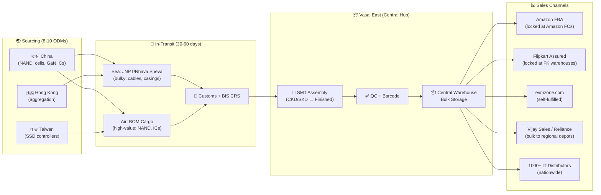
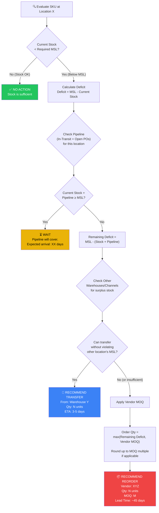
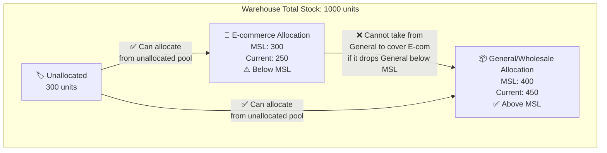

# EVM × Axiom Labs — MSL & Inventory Automation
## Understanding Document + Discovery Questionnaire

---

## 1. Executive Summary

Following the discovery meeting with EVM, Axiom Labs has identified a clear automation opportunity: **replacing the manual, spreadsheet-driven inventory replenishment process with an intelligent decision engine** that considers the full supply chain picture before recommending action.

This document captures:
- Our understanding of EVM's business and the problem
- The decision logic we believe needs to be automated
- A structured questionnaire to validate assumptions and gather missing details from EVM (via Prashant)
- Foundation for the production-grade system design (Phase 3)

---

## 2. Our Understanding of EVM's Business

### 2.1 Company Profile

| Attribute | Detail |
|---|---|
| **Brand** | EVM (evmzone.com) |
| **Parent Company** | Hundia Info Solutions Pvt. Ltd. (CIN: U72900MH2006PTC160074) |
| **HQ** | 101/102, Diamond Plaza, Lamington Road, Mumbai 400004 |
| **Founded** | 2006 (business since 1999 as proprietorship) |
| **Key People** | Rameshji Hundia (Founder/Chairman), Kunal Hundia (CEO-HIPL), Vishal Hundia (CEO-EVM), Aatish Hundia (Director) |
| **Positioning** | "Made in India" electronics — SMT assembly at Vasai East facility |
| **Product Range** | SSDs, RAM, Chargers, Power Banks, Cables, Hubs, TWS Earbuds, Smartwatches, Motherboards, Peripherals |
| **Est. SKU Count** | **500–600 active SKUs** (launched 120+ new SKUs across 12 categories in 2024 alone) |
| **Revenue** | ~₹390-400 crore FY25 (EVM brand = ~70% of revenue) |
| **Credit Rating** | CRISIL BBB-/Stable/A3 (upgraded April 2025) |
| **Team Size** | ~47-100 core employees; 200-500+ across operations |
| **Central Warehouse** | Square Industrial Park, Vasai East, Maharashtra (multi-floor: SMT assembly, QC, warehousing, RMA) |
| **Service Network** | 500+ authorized service centers across India |
| **Distribution** | 1000+ channel partners, resellers, and system integrators nationwide |

### 2.2 Sales Channels (Confirmed)

| Channel | Type | Fulfillment Model | Notes |
|---|---|---|---|
| **evmzone.com** | Own D2C store (Magento 2) | Self-fulfilled from Vasai East warehouse | Primary brand storefront, warranty registration portal |
| **Amazon.in** | Marketplace | **FBA** via Clicktech Retail (ex-Appario) + Cocoblu Retail (ex-Cloudtail) | Dedicated EVM Brand Store; also many unauthorized 3P sellers (NBCGadgetzone, adsstore, etc.) |
| **Flipkart** | Marketplace | **Flipkart Assured** via RetailNet + 3P sellers (e.g., KrishnaTechRetail18) | Brand catalog across SSDs, RAM, drives, power banks |
| **Vijay Sales** | Modern Retail (LFR) | Wholesale/distributor | Physical + online; stocks SSDs, power banks, accessories |
| **Reliance Digital** | Modern Retail (LFR) | Wholesale/distributor | Power banks (Enjoy series), chargers, accessories |
| **Wholesale/Distributors** | Traditional IT channels | Bulk shipments to regional depots | 1000+ channel partners; Lamington Rd, Nehru Place, SP Road, Chandni Chowk |
| **KARNAGE** | Sub-brand (Gaming) | Same infrastructure | New gaming peripherals line (keyboards, mice, headsets) |

> [!IMPORTANT]
> **Confirmed from research:** EVM uses **FBA** (via Clicktech/Cocoblu) and **Flipkart Assured** (via RetailNet). This means a portion of inventory is **physically locked at Amazon/Flipkart warehouses** and managed separately. Key remaining questions: (1) Does EVM track FBA/FK-Assured stock in their internal systems? (2) How do they decide how much to send to FBA vs. keep in own warehouse? (3) Are FBA replenishment decisions part of the manual process they want automated?

### 2.3 Supply Chain Overview



---

## 3. Our Understanding of the Problem

### 3.1 Current State (Pain Points)

| Aspect | Current State | Problem |
|---|---|---|
| **Process** | Manual, done by ~2 people | Time-consuming, error-prone, doesn't scale |
| **Tools** | Google Sheets + ReactJS/.NET internal app | Data scattered, no unified decision engine |
| **Decision Making** | Human judgment per SKU | Inconsistent, slow, can miss pipeline inventory |
| **Frequency** | Periodic manual review | Reactive rather than proactive |
| **Visibility** | Fragmented across sheets and app | No single view of effective supply position |

### 3.2 The Core Problem — Illustrated

The problem is **NOT** simply "stock < MSL → reorder." The real question is much more nuanced:

```
╔══════════════════════════════════════════════════════════════╗
║  For each SKU, across each location/channel:                ║
║                                                              ║
║  EFFECTIVE SUPPLY = Current Stock                            ║
║                   + In-Transit / Pipeline Inventory          ║
║                   + Open Purchase Orders (not yet shipped)   ║
║                   + Transferable Stock (from other locations)║
║                                                              ║
║  EFFECTIVE DEMAND = MSL Requirement                          ║
║                   + E-commerce MSL (separate)                ║
║                   + Committed/Reserved Orders                ║
║                   + Channel-specific minimums                ║
║                                                              ║
║  DECISION = Is EFFECTIVE SUPPLY ≥ EFFECTIVE DEMAND?          ║
║             If YES → No action needed                        ║
║             If NO  → Transfer or Reorder (with MOQ)          ║
╚══════════════════════════════════════════════════════════════╝
```

### 3.3 The Decision Engine — Our Proposed Logic

Based on the meeting discussion, we believe the automation needs to implement this decision tree for **each SKU at each location/channel**:



### 3.4 E-commerce Inventory — Special Handling

E-commerce inventory is **ring-fenced** — it has its own MSL that must be protected:



> [!WARNING]
> **Critical assumption to validate:** We assume e-commerce and general inventory have *separate* MSL values. We need EVM to confirm: Is the e-commerce MSL per-channel (Amazon MSL, Flipkart MSL, own website MSL) or a single pooled e-commerce MSL?

---

## 4. Key Concepts & Terminology

For alignment between Axiom Labs and EVM team:

| Term | Definition (as we understand it for EVM) |
|---|---|
| **MSL** | Minimum Stock Level — the floor quantity below which stock should not fall for a given SKU at a given location/channel |
| **Pipeline Inventory** | Stock that has been ordered from vendor but not yet received at warehouse (in-transit from China/Taiwan/HK, typically 30-60 days) |
| **Open PO** | Purchase Order placed with vendor but goods not yet shipped |
| **Effective Supply** | Current Stock + Pipeline + Open POs — the total units that will eventually be available |
| **MOQ** | Minimum Order Quantity — the smallest order a vendor will accept |
| **Lead Time** | Time from placing PO to goods arriving at EVM warehouse (includes manufacturing, shipping, customs) |
| **Internal Transfer** | Moving stock from one EVM warehouse/channel to another |
| **Ring-fenced Inventory** | Stock allocated exclusively to a specific channel (e.g., e-commerce) that cannot be reassigned without explicit approval |
| **Surplus** | Stock at a location that exceeds its MSL — potentially available for transfer |
| **Deficit** | The gap between current stock and required MSL |

---

## 5. Discovery Questionnaire for EVM

> [!IMPORTANT]
> The following questionnaire should be shared with **Prashant** to clarify EVM's specific business rules, data sources, and constraints. Answers to these questions will directly shape the system design.

---

### Section A: Inventory Structure & Locations

> Understanding where stock sits and how it's organized.

**A1.** How many warehouses/fulfillment locations does EVM operate?
- Please list each warehouse with its city/region and primary purpose (e.g., "Mumbai — main warehouse, ships to all channels")

**A2.** Does EVM use **FBA (Fulfilled by Amazon)**? If yes:
- Is all Amazon inventory FBA, or is some self-fulfilled / Seller Flex?
- Do you track FBA inventory levels in your internal system, or only via Amazon Seller Central?

**A3.** Does EVM use Flipkart's fulfillment services (Flipkart Assured / F-Assured)?
- Same question: Is Flipkart inventory tracked internally or only on Flipkart's portal?

**A4.** Is inventory for **offline retail** (Reliance Digital, Croma, distributors) managed from the same warehouse pool, or do you have separate distributor stock?

**A5.** Are there any **consignment** arrangements where EVM stock sits at a third-party location but EVM still owns it?

---

### Section B: MSL Rules & Definitions

> Understanding how minimum stock levels are set and applied.

**B1.** How are MSL values currently defined? (Select all that apply)
- [ ] Per SKU globally (one MSL for the whole company)
- [ ] Per SKU per warehouse
- [ ] Per SKU per sales channel (Amazon, Flipkart, own site, offline)
- [ ] Per product category
- [ ] Other: _______________

**B2.** Who decides MSL values? How often are they reviewed/updated?

**B3.** Is the MSL a **fixed number** (e.g., "always keep 200 units") or is it **dynamic** (changes based on season, demand velocity, promotions)?

**B4.** Are MSL values currently stored in:
- [ ] Google Sheets
- [ ] The ReactJS/.NET internal application
- [ ] Both
- [ ] Other: _______________

**B5.** Does e-commerce have **separate** MSL values from general/wholesale? If yes:
- Is there a single "e-commerce MSL" or separate MSLs per marketplace (Amazon MSL, Flipkart MSL, etc.)?

**B6.** Are there **different MSL tiers** (e.g., critical/warning thresholds)? For example:
- Below MSL → Warning
- Below 50% of MSL → Critical / Urgent

---

### Section C: Purchase Orders & Pipeline Inventory

> Understanding how incoming stock is tracked.

**C1.** How are purchase orders to vendors currently created and tracked?
- [ ] In the ReactJS/.NET internal application
- [ ] In Google Sheets / Excel
- [ ] In an ERP (Tally, SAP, Zoho, etc.)
- [ ] Other: _______________

**C2.** For each PO, what information is typically recorded?
- [ ] Vendor name
- [ ] SKU(s) and quantities
- [ ] Order date
- [ ] Expected delivery date
- [ ] Actual shipment date
- [ ] Shipping/tracking details
- [ ] Customs clearance status
- [ ] PO status (draft / confirmed / shipped / in-transit / received)
- [ ] Other: _______________

**C3.** How do you currently track **in-transit** inventory? Is there a system that shows "500 units of SKU-X are on a ship, expected to arrive on Date Y"?

**C4.** What is the typical lead time for your main product categories?
| Category | Typical Lead Time (days) |
|---|---|
| Chargers | ___ |
| Power Banks | ___ |
| Cables | ___ |
| Hubs/SSDs | ___ |
| Other: ___ | ___ |

**C5.** Do lead times vary significantly by vendor? How many primary vendors does EVM work with?

**C6.** Is there ever a situation where a PO is **partially fulfilled** (e.g., ordered 1000 units, vendor ships 600 first, 400 later)?

---

### Section D: Internal Transfers

> Understanding how stock moves between EVM's own locations.

**D1.** How frequently do internal stock transfers happen today?
- [ ] Daily
- [ ] Weekly
- [ ] Monthly
- [ ] Rarely / ad-hoc
- [ ] Never

**D2.** What triggers an internal transfer decision currently? Who makes this decision?

**D3.** What is the typical transit time for an internal transfer (e.g., Mumbai → Delhi warehouse)?

**D4.** Are there any **costs or constraints** associated with internal transfers that the system should consider? (e.g., minimum transfer quantity, logistics costs, specific carriers)

**D5.** When transferring stock, are there any **approval workflows** required?

---

### Section E: Vendor & MOQ Details

> Understanding vendor ordering constraints.

**E1.** How many primary vendors/suppliers does EVM work with? (Approximate count)

**E2.** Are MOQs defined:
- [ ] Per SKU
- [ ] Per product category
- [ ] Per vendor (combined value MOQ across SKUs)
- [ ] Other: _______________

**E3.** Can EVM combine multiple SKUs in a single PO to meet a vendor's **value-based MOQ** (e.g., $10,000 minimum order combining different products)?

**E4.** Are there **payment terms** that affect ordering decisions? (e.g., advance payment required, LC, etc.)

**E5.** Do vendors have **production lead times** separate from **shipping lead times**? (i.e., need to book production capacity in advance)

---

### Section F: E-commerce Specific

> Understanding marketplace-specific inventory needs.

**F1.** Which e-commerce channels does EVM actively sell on? (Confirm all)
- [ ] evmzone.com (own Magento store)
- [ ] Amazon.in
- [ ] Flipkart
- [ ] Myntra
- [ ] Blinkit / Zepto / Instamart (quick commerce)
- [ ] Other: _______________

**F2.** For Amazon.in:
- Does EVM have access to **Amazon Seller Central** / SP-API?
- Can we get API access to pull inventory levels, sales velocity, etc.?
- Who manages the Amazon seller account?

**F3.** For Flipkart:
- Similar question — is there API access available?
- Who manages the Flipkart seller account?

**F4.** Are there **marketplace-specific inventory requirements**? For example:
- Amazon may require minimum days of supply
- Flipkart Assured may require stock at specific fulfillment centers
- Any SLA commitments on stock availability

**F5.** Does EVM track **channel-wise sales velocity** (units sold per day per channel per SKU)? Where is this data?

---

### Section G: Current Systems & Data

> Understanding the existing tech landscape for integration.

**G1.** The ReactJS + .NET internal application:
- What does it currently do? (Inventory tracking? Order management? Reporting?)
- Is it hosted (cloud/on-prem)?
- Does it have an API we can integrate with?
- Who built/maintains it?
- What database does it use? (SQL Server, MySQL, etc.)

**G2.** What data is in Google Sheets vs. the internal application?
| Data Type | In Google Sheets? | In Internal App? | Both? |
|---|---|---|---|
| Product catalog / SKU master | | | |
| Current inventory levels | | | |
| MSL values | | | |
| Purchase orders | | | |
| Sales data / velocity | | | |
| Vendor information | | | |
| Transfer records | | | |

**G3.** Does EVM use any of these systems?
- [ ] Tally (for accounting/GST)
- [ ] Unicommerce / EasyEcom (for marketplace integration)
- [ ] SAP Business One
- [ ] Zoho Inventory / Books
- [ ] Other ERP: _______________
- [ ] None of the above

**G4.** How does inventory data currently get updated? (e.g., barcode scanning at warehouse, manual entry, marketplace auto-sync?)

**G5.** Is there a **single source of truth** for inventory today, or is data scattered across multiple systems?

---

### Section H: Outputs & Alerts

> Understanding what the team needs from the automated system.

**H1.** What should the system output when it makes a recommendation?
- [ ] Dashboard notification (web-based)
- [ ] Email alert
- [ ] WhatsApp notification
- [ ] Slack notification
- [ ] Auto-generated Purchase Order (draft)
- [ ] Auto-generated Transfer Order (draft)
- [ ] Daily/weekly digest report
- [ ] Other: _______________

**H2.** Should the system **auto-execute** decisions (e.g., automatically create a PO draft), or should it **recommend and wait for human approval**?

**H3.** Who are the users of this system? (Names/roles of people who would use the dashboard daily)

**H4.** How often should the system re-evaluate inventory positions?
- [ ] Real-time (continuous)
- [ ] Every few hours
- [ ] Once daily
- [ ] On-demand (manual trigger)

**H5.** Would a **mobile-friendly** interface be important? (For checking alerts on the go)

---

### Section I: Scale & Scope

> Understanding the size of the problem.

**I1.** How many active SKUs does EVM currently manage? (Approximate)
- Total product count: ___
- Active SKUs (with regular sales): ___

**I2.** Roughly how many purchase orders are placed per month?

**I3.** Roughly how many internal transfers happen per month?

**I4.** Are there seasonal peaks where inventory management becomes especially critical? (e.g., Diwali, Republic Day sales, Amazon Great Indian Festival)

**I5.** Is there a **budget or timeline** in mind for this project?

---

### Section J: Data EVM Can Provide

> Understanding what Axiom Labs can start working with.

**J1.** Can EVM provide a **sample export** of the following? (Even anonymized/partial data would help)
- [ ] Product/SKU master list (SKU, name, category, variants)
- [ ] Current inventory snapshot (SKU × location × quantity)
- [ ] MSL values (SKU × location/channel × MSL quantity)
- [ ] Recent purchase orders (last 3 months)
- [ ] In-transit inventory list
- [ ] Sales data / order history (last 3 months, even aggregated)
- [ ] Vendor list with MOQ and lead time information

**J2.** Can EVM provide **view-only access** to:
- [ ] The ReactJS/.NET internal application (for us to understand the data model)
- [ ] Relevant Google Sheets
- [ ] Amazon Seller Central (for API exploration)
- [ ] Flipkart Seller Dashboard

**J3.** Is Prashant authorized to share this data, or does it require additional approval?

---

## 6. What Axiom Labs Needs Next

To move from this understanding document to a concrete first-iteration solution proposal, we need:

| Priority | What We Need | From Whom |
|---|---|---|
| 🔴 **Critical** | Answers to Sections A, B, C, G (Inventory structure, MSL rules, PO tracking, current systems) | Prashant |
| 🔴 **Critical** | Sample data exports (even partial) — see Section J | Prashant |
| 🟡 **Important** | Answers to Sections D, E, F (Transfers, vendors, e-commerce specifics) | Prashant |
| 🟢 **Nice to have** | Answers to Sections H, I (Outputs, scale) | Prashant / EVM management |
| 🟢 **Nice to have** | Access to internal app / Google Sheets (view-only) | Prashant + IT approval |

---

## 7. Preliminary System Architecture (High-Level)

Based on our current understanding, the production system would look like:

```mermaid
flowchart TD
    subgraph Data_Sources["📊 Data Sources"]
        SHEETS["Google Sheets\n(MSL, manual data)"]
        DOTNET["ReactJS/.NET App\n(existing internal tool)"]
        AMZ_API["Amazon SP-API\n(sales, inventory)"]
        FK_API["Flipkart API\n(sales, inventory)"]
        MANUAL["Manual Input\n(PO updates, transfers)"]
    end

    subgraph Integration["🔌 Integration Layer"]
        SYNC["Data Sync Engine\n(scheduled + event-driven)"]
        NORMALIZE["Data Normalizer\n(unified schema)"]
    end

    subgraph Core["🧠 Decision Engine"]
        DB[("📀 Database\n(PostgreSQL)")]
        ENGINE["Replenishment\nDecision Engine"]
        RULES["Business Rules\n(MSL, MOQ, Lead Time)"]
    end

    subgraph Output["📤 Outputs"]
        DASHBOARD["📊 Web Dashboard\n(Real-time visibility)"]
        ALERTS["🔔 Alerts\n(Email / WhatsApp)"]
        REPORTS["📋 Reports\n(Daily digest, PO drafts)"]
        API_OUT["🔗 API\n(Integration with .NET app)"]
    end

    SHEETS --> SYNC
    DOTNET --> SYNC
    AMZ_API --> SYNC
    FK_API --> SYNC
    MANUAL --> SYNC

    SYNC --> NORMALIZE
    NORMALIZE --> DB

    DB --> ENGINE
    RULES --> ENGINE

    ENGINE --> DASHBOARD
    ENGINE --> ALERTS
    ENGINE --> REPORTS
    ENGINE --> API_OUT
```



> [!NOTE]
> This architecture is preliminary. The final design will depend heavily on the questionnaire answers — particularly around what data sources exist and what integrations are feasible.

---

## 8. Proposed Engagement Timeline

| Phase | Deliverable | Timeline |
|---|---|---|
| **Phase 1** (Current) | Understanding document + Questionnaire | ✅ Complete |
| **Phase 2** | Receive questionnaire answers from Prashant | 2-3 days |
| **Phase 3** | First-iteration solution proposal (detailed tech design) | 2-3 days after Phase 2 |
| **Phase 4** | Review with Prashant + iterate | 1 session |
| **Phase 5** | Development kickoff | After commercial alignment |

---

## 9. Appendix: Domain Concepts Reference

### A. MSL vs ROP vs Safety Stock

```
Stock Level
│
│  ┌─── Maximum Stock Level
│  │
│  │    ← Order arrives, stock replenished
│  │
│  │
│  ├─── Reorder Point (ROP)     ← "Time to place a PO"
│  │    = (Avg Daily Demand × Lead Time) + Safety Stock
│  │
│  │    ← Stock consumed during lead time
│  │
│  ├─── MSL / Safety Stock      ← "Floor — stock should not go below this"
│  │    = Buffer for demand variability + lead time variability
│  │
│  └─── Stockout                ← "Emergency — lost sales"
│
└──────── Time →
```

### B. Available-to-Promise (ATP) Calculation

```
ATP = On-Hand Inventory
    - Reserved / Committed Orders
    + In-Transit Inventory (arriving within planning horizon)
    + Open POs (confirmed, within planning horizon)
    - Safety Stock (MSL)
```

If **ATP > 0** → No replenishment needed
If **ATP < 0** → Replenishment required (transfer or vendor PO)

### C. Transfer Feasibility Check

```
For Source Warehouse W:
  Transferable_Qty = Current_Stock(W) - MSL(W) - Reserved(W)
  
  If Transferable_Qty > 0:
    Can transfer up to Transferable_Qty units
    without violating W's own MSL
```

### D. MOQ-Adjusted Order Quantity

```
Raw_Deficit = Required_Qty - (Current_Stock + Pipeline)
Adjusted_Qty = max(Raw_Deficit, Vendor_MOQ)

If vendor requires multiples of MOQ:
  Adjusted_Qty = ceil(Raw_Deficit / MOQ) × MOQ
```
